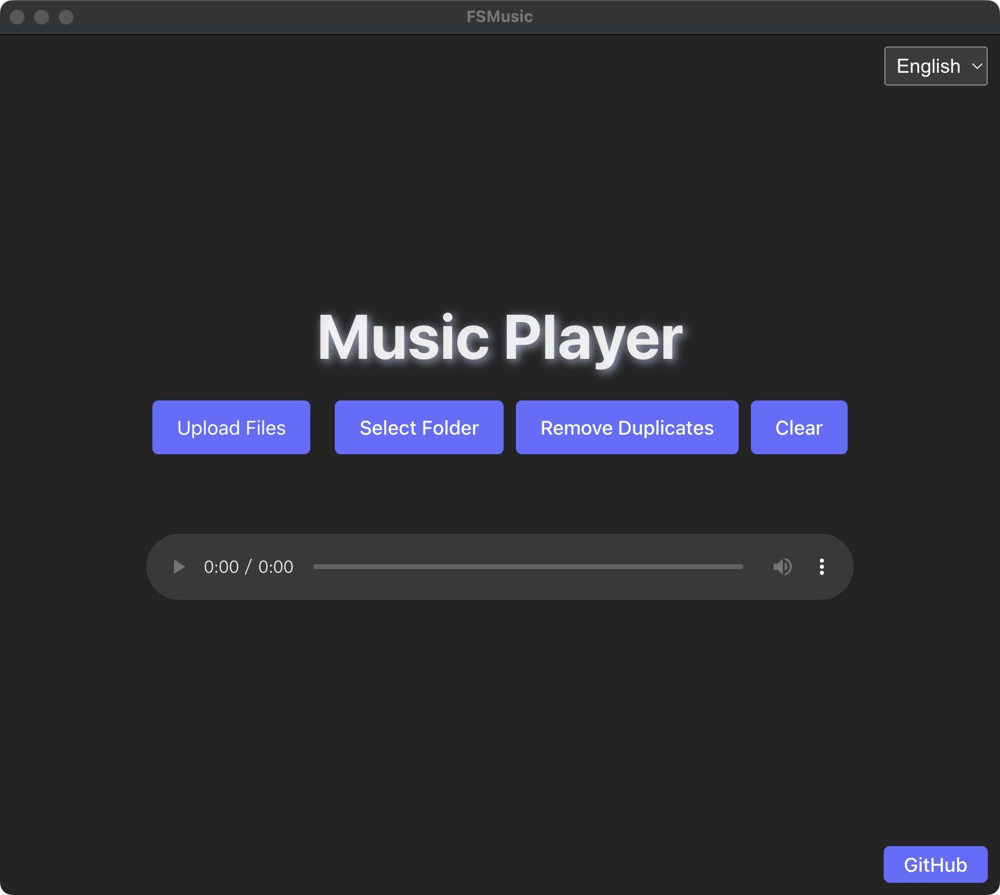
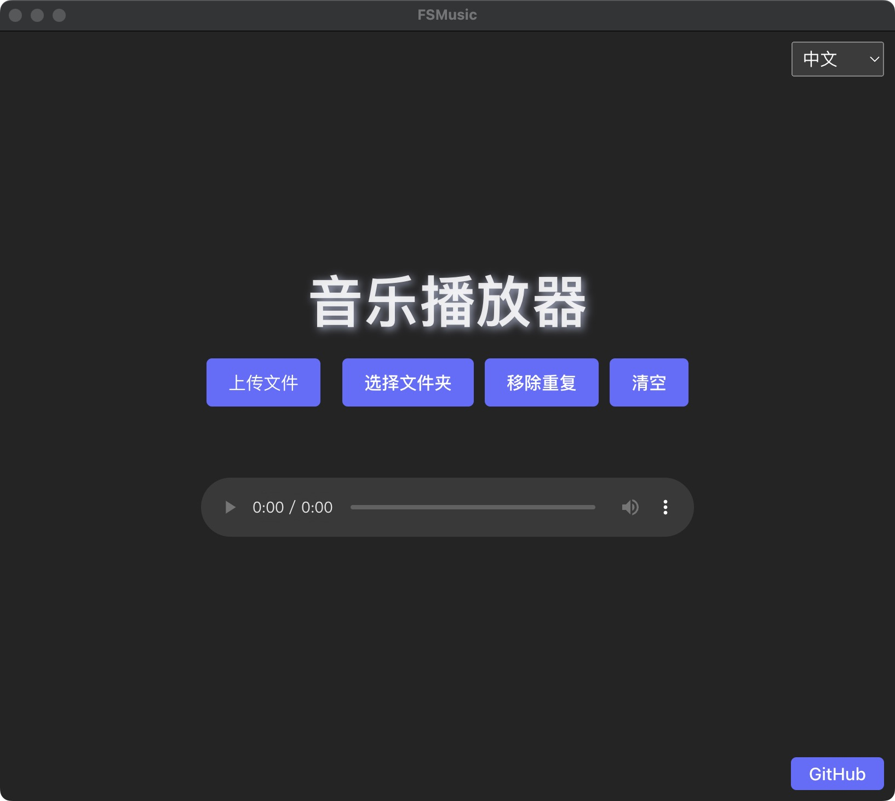
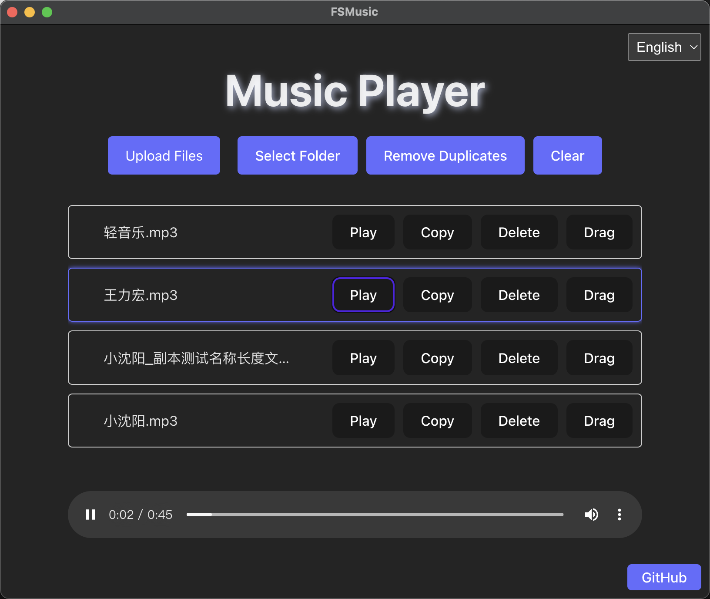

# FSmuisc

## 项目介绍

HFmusic 是一个基于 Electron + Vue 3 + Vite + TypeScript 的音乐播放器项目，针对于 macOS 系统**无法导入播放器，并排序的问题解决**。

解决场景(macOS)：

- 比如：公司年会，婚庆等等... 音乐需要提前设置**顺序**的播放流程，**排序**来完成这个流程，这个时候一般有自己本地的音乐，但是使用 macOS 电脑的用户音乐播放器这类需求都不怎么完善，不是导不进去就是排序不行。

- 还有就是一个流程里面，可能有一首歌需要播放几次，这个时候就可以使用复制功能去完善这个播放流程。

## 功能说明

- 支持中英文切换
- 音乐播放
- 连续播放
- 音乐播放列表管理
- 本地音乐导入
- 本地文件夹导入(查找所有 .mp3 文件，包括子文件内)
- 复制音乐
- 托拽音乐列表

## 安装说明

1. 安装依赖

```bash
pnpm install
```

2. 运行开发环境

```bash
pnpm dev
```

3. 打包

```bash
#目前只做了mac打包，其他打包方式请自行修改
yarn build:mac
```

## 打包后目录结构

```
├── release
│   ├── mac-arm64  #mac arm64架构
│   │   ├── ....
│   │   └── ....
│   ├── ....
│   ├── HFmusic.dmg #mac安装包
│   ├── ....
```

## 项目截图

## 项目截图

<style>
   .inline-images{
      display: flex;
      align-items: center;
      justify-content: space-between;
   }
  .inline-images img {
    width: 265px;
    height: 200px;
    display: inline-block;
  }
</style>

<div class="inline-images">
  
  
  
</div>
